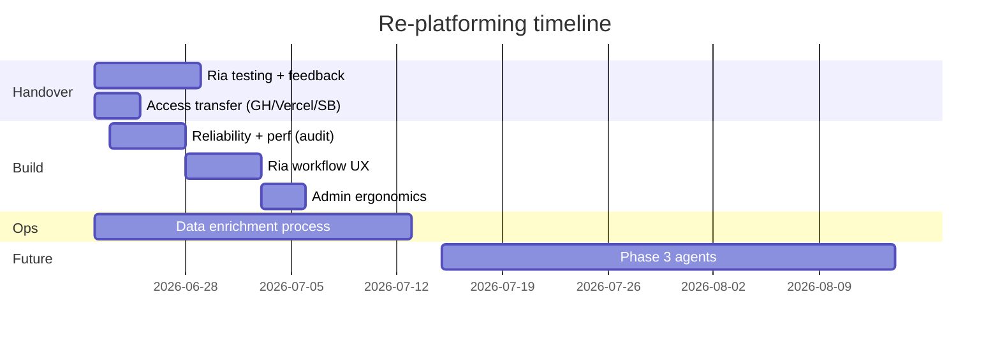

# Re-platforming plan — Ria handover and V1 hardening

- Date: 2026-06-22
- Participants: Ria Sharma, Chris Edwards
- Status: Active
- Related: [product-brief-v1.md](../product-brief-v1.md), [workflows.md](../specs/workflows.md), [cursor-brief-audit-fixes.md](../cursor-brief-audit-fixes.md), [ADR 0009](../decisions/0009-agent-workflows.md)

---

## Goal

Get Ria operating Ecosystem as the PU relationship ops hub: triage contacts, track chief-owned relationships, monitor meeting cadence, and prepare for event-driven onboarding — without manual LinkedIn stalking or Notion shadow systems.

Success looks like Ria using Profiles + Calendar review daily within two weeks, with role/company completeness improving week over week.

---

## Current state

| Area | Status |
|---|---|
| ~319 profiles (Christmas 2024 onwards) | Loaded |
| Google Calendar sync + review queue | Shipped |
| Profiles filters (owner, company, status, tags) | Shipped |
| CSV import + soft-match review | Shipped |
| Gmail sync | Not implemented (deferred) |
| Profile completeness triage | Shipped |
| Admin "view as chief" toggle | Shipped |
| City filter on Profiles | Shipped |
| AI / people pulse agents | Phase 3 (ADR 0009) |

Known pain from demo: slow first load, calendar context skews toward future meetings, most profiles missing role/company.

---

## Phases



---

## Phase 0 — Handover and feedback (now → ~1 week)

**Owner:** Ria (testing), Chris (access)

### Ria: exploration checklist

Work through these in a focused session. Note URL + screenshot for anything broken or confusing.

- [ ] Log in, confirm own account shows only owned relationships on `/me`
- [ ] Profiles: filter by company, owner, status; open drawer; edit role/company/city
- [ ] Tag people; confirm tags persist and filter works
- [ ] Admin → Calendar sync review: link, create profile, ignore; note if meeting context feels past vs future
- [ ] Admin → Import: upload a small CSV (or LoM export); confirm dedup/retag behaviour on existing profiles
- [ ] Events: create event, add attendees, confirm activity on profile timeline
- [ ] Search: find person by name/company; check last interaction visible in results
- [ ] Connect / Orbit: note empty states (Phase 2 surfaces — expected if sparse)

### Chris: access transfer

- [ ] GitHub: invite Ria to `ecosystem` repo (maintain or admin as appropriate)
- [ ] Vercel: add Ria to project; confirm preview deploys work
- [ ] Supabase: add Ria to org/project; document which keys live where (no secrets in repo)
- [ ] Google OAuth: confirm Ria can connect her calendar under admin (or document who holds the integration)
- [ ] Brief on clone path for Caffeine (duplicate repo, fresh DB, no PU hard-coding)

### Deliverable

A short feedback doc or issue list grouped as: **bugs**, **UX friction**, **missing for daily use**, **nice-to-have**. Target ≤10 P0/P1 items.

---

## Phase 1 — Reliability and performance

**Owner:** Chris (build)  
**Source:** [cursor-brief-audit-fixes.md](../cursor-brief-audit-fixes.md)

Fix before Ria scales daily use. No schema changes except perf indexes (#16/#27).

### P0 — must ship

| # | Issue | Why it matters for Ria |
|---|---|---|
| 1 | Backfill out of `after()` hook | First calendar connect may silently fail partial sync |
| 2 | N+1 in `match.ts` | Timeouts on first sync / large calendars |
| 6 | Cron 200 on partial success | Retry loops on one bad event |
| 8 | `listProfiles()` pagination | Slow Profiles page at 319+ rows |
| 9 | `recency.ts` DISTINCT ON RPC | Slow overview and sort-by-recency |

### P1 — ship in same session if possible

| # | Issue | Why |
|---|---|---|
| 5 | Import worker local counters | Accurate import summaries |
| 12 | Gaxios 410 for expired sync token | Robust calendar reconnect |
| 13 | 429 early exit on rate limit | Cron stability |
| 17 | Profile page parallel queries | Faster drawer/page open |
| 16/27 | Perf indexes + pg_trgm | Search and filter at scale |

### Exit criteria

- Profiles page loads in <2s with 350 profiles
- Calendar connect completes backfill via cron within one run cycle
- No silent partial sync after OAuth connect (banner or status visible)

---

## Phase 2 — Ria's daily workflow UX

**Owner:** Chris (build), informed by Phase 0 feedback  
**Constraint:** Schema-locked — no new tables/columns

### 2.1 Profile completeness triage

**Status:** Shipped (2026-06-22).

- Filters: `/profiles?complete=missing-company`, `missing-role`, `missing-both`
- Admin hub shows counts with links to each triage view

### 2.2 Calendar review: past-first context

**Status:** Shipped (2026-06-22).

- Review cards use the **most recent past** meeting for context, not the next upcoming invite.
- Matched-meetings tab lists past `calendar_sync` activities only.
- Future invites within the 4-week window still appear in the **unmatched review queue** for link/create/ignore.

### 2.3 Event onboarding capture

**Problem:** Going forward, role/company should be captured at events, not via LinkedIn.

**Process (no code required initially):**

- Event check-in / RSVP form fields: name, email, company, role, city
- CSV column mapping already supports `occupation`, `location_city`, `organisation_name`
- Document standard LoM/export column map for Ria

**Optional build:** Required fields on "create profile from calendar review" form (company + occupation prompts).

---

## Phase 3 — Admin ergonomics

**Owner:** Chris (build)  
**Depends on:** Phase 2 stable

### 3.1 "View as" chief toggle

**Status:** Shipped (2026-06-22). Sidebar selector for admins; applies to Profiles, Orbit, and Search via cookie + `resolveViewAsOwnerId()`.

### 3.2 City filter

**Status:** Shipped (2026-06-22). City dropdown on Profiles (`?city=`).

### 3.3 Status / circle automation (rules)

Deferred design session. Ria mentioned automating what "in a circle" means (e.g. X meetings → tag or status change). Capture as ADR when rules are defined — do not guess in code.

---

## Phase 4 — Data enrichment (ongoing, parallel)

**Owner:** Ria (manual + process), agent assist later

| Track | Action |
|---|---|
| Historical 319 | Triage via completeness filter; fill role/company from memory, email sigs, event records |
| New contacts | Calendar review → create with company; event CSV with required columns |
| Relational fields | Trust, influence, notes — enrich only when Ria/chiefs are actively working that person |
| LinkedIn | Manual lookup for high-priority gaps only; no scraping |
| Agent cleanup | Phase 3 — Tier B suggestions only (company from domain, role from title); never overwrite; see ADR 0010 |

**Target:** ≥80% of active-circle profiles have company + role within 4 weeks of Phase 2 shipping.

---

## Phase 5 — Stretch goals (Phase 3)

**Not V1.** Workflows in [ADR 0009](../decisions/0009-agent-workflows.md); **write policy** in [ADR 0010](../decisions/0010-automation-boundaries.md) — auto capture, async human triage for identity/judgment only.

| Capability | Trigger data needed |
|---|---|
| Weekly people pulse per chief | Owner assignments, activities, calendar, completeness |
| "Growth marketers in NZ scale-ups" query | Tags, occupation, company, city populated |
| Pre-meeting brief | Profile + activity timeline + connections |
| Intro routing draft | Multi-owner strength, connections graph |

Prerequisite: Phases 1–4 — especially profile completeness and reliable calendar activities.

---

## Explicit non-goals (this plan)

- Gmail sync implementation
- Subjective score columns (Influence, Trust, Warmth)
- AI chat box in V1
- Schema changes beyond perf indexes
- LinkedIn scraping/integration
- Full Orbit/Connect polish (Phase 2 product)

---

## Decision log (resolved 2026-06-22)

| Question | Decision |
|---|---|
| Calendar sync window | All past meetings (12-month backfill) **plus 4 weeks** of upcoming invites. Upcoming events stay in `calendar_events` and the review queue; they do **not** appear as profile activities or on Overview recent activity until the meeting date has passed. |
| Recent activity on Overview | Past relationship events only — notes, past meetings, imports, manual logs. Not future calendar invites. |
| Screens to fix | **All:** Overview recent activity, calendar review context (past-first sample), profile activity timeline, last-interaction recency RPC. |
| Ria admin role | **Admin** (`rs@previously.co`). New logins bootstrap as `member`; promote via sync script or SQL (see below). |
| Email connect for team | Defer; calendar is the primary auto-capture path. |

### Promote Ria to admin (production)

If Ria already logged in (bootstrap created a `member` row under her auth UUID):

```sql
update public.users
set role = 'admin'
where lower(email) = 'rs@previously.co';
```

Or run `node --env-file=.env.local scripts/sync-pu-team.mjs` (includes Ria as admin; matches auth user by email).

**Verify:** Ria sees **Admin** in the sidebar and can open `/admin/calendar-sync/review`. On `/me`, the admin section appears when `role = 'admin'`.

---

## Session order for Cursor

When building, run sessions in this order:

1. **Audit P0** — `docs/cursor-brief-audit-fixes.md` items #1, #2, #6, #8, #9
2. **Audit P1** — #5, #12, #13, #16, #17, #27
3. **Completeness triage** — Phase 2.1
4. **Calendar past-first** — Phase 2.2
5. **View as + city filter** — Phase 3

Each session: read `docs/ai-conventions.md`, run linter, no schema except agreed migration.

---

## Review cadence

- **Week 1:** Ria feedback call after Phase 0 checklist
- **Week 2:** Demo Phase 1 perf + Phase 2 triage filter
- **Week 4:** Completeness metric check; prioritise Phase 3 vs Phase 5

---

## References

- Meeting check-in: 2026-06-22 (Ria + Chris)
- Audit backlog: [cursor-brief-audit-fixes.md](../cursor-brief-audit-fixes.md)
- Review queue spec: [admin-review.md](../specs/admin-review.md)
- Core workflows: [workflows.md](../specs/workflows.md) — especially Workflow 3 (post-event triage) and Workflow 4 (reconnect loop)
